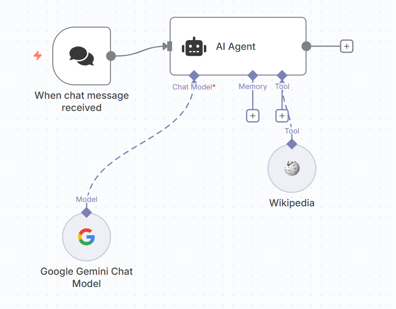

# Wikipedia Question-Answering Agent

This project is a simple but powerful AI agent built in n8n that can answer factual questions on a vast range of topics. It uses the built-in Wikipedia tool to look up information in real-time.

## Key Features

- **Factual Q&A:** Directly answers user questions by searching Wikipedia.
- **AI-Powered Summarization:** Uses Google Gemini to process and summarize the information found on Wikipedia into a concise answer.
- **Simple & Efficient:** A lightweight and effective demonstration of an AI agent's ability to use external knowledge tools.

## Technologies Used

- **n8n** for workflow automation
- **Google Gemini Pro** as the core LLM
- **Wikipedia API** (via the n8n Wikipedia node)

## How to Use

1.  Download the `wikipedia-agent-workflow.json` file from this repository.
2.  Import the JSON file into your n8n instance.
3.  Add your own credentials for the Google Gemini node.
